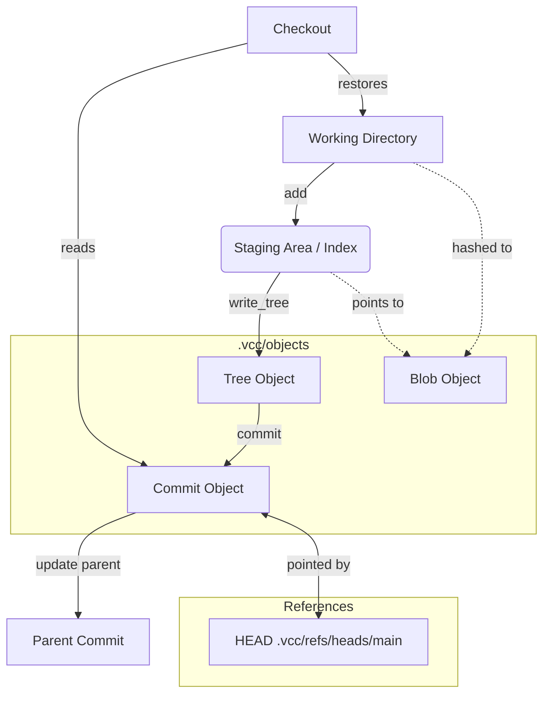

# VCC Architecture Overview

VCC's architecture is built around several core components that manage different aspects of version control:

1. **Repository Manager (`RepoManager`)**: Handles the initialization of the repository and verification of the `.vcc` structure.
2. **Index Area (`IndexManager`)**: Acts as the staging area where files are hashed into blobs and recorded before a commit. It respects patterns defined in `.vccignore`.
3. **Tree Manager (`TreeManager`)**: Converts the staged files in the index into a hierarchical tree object.
4. **Commit Manager (`CommitManager`)**: Wraps a tree object along with metadata (author, message, parent commit) into a commit object and updates the `HEAD`.
5. **Checkout Manager (`CheckoutManager`)**: Restores the working directory to reflect the state of a specific commit hash.
6. **Log Manager (`LogManager`)**: Traverses the commit history backward from `HEAD` to display a log of changes.

## System Flow Diagram

## Function Summary

Below is a detailed breakdown of each class and its internal functions responsible for VCC's behavior.

| Class / File | Function | Purpose |
|--------------|----------|---------|
| `CheckoutManager` | `checkout` | Restores the working directory to match a specific commit hash. |
| `CheckoutManager` | `read_object` | Reads and returns the content of an object from the `.vcc/objects` directory. |
| `CheckoutManager` | `find_tree_hash` | Parses a commit object to extract and return its associated tree hash. |
| `CheckoutManager` | `restore_tree` | Parses a tree object and overwrites working directory files with the blob contents. |
| `CommitManager` | `commit` | Creates a commit object linking a new tree to the parent commit and updates `HEAD`. |
| `CommitManager` | `get_head_hash` | Retrieves the commit hash that `HEAD` (the current branch) currently points to. |
| `CommitManager` | `update_head` | Updates the `HEAD` reference to point to a new commit hash. |
| `IndexManager` | `add` | Hashes a file, stores its blob, and updates the index (staging area). |
| `IndexManager` | `should_ignore` | Checks if a file matches any patterns listed in the `.vccignore` file. |
| `IndexManager` | `read_index` | Reads the `.vcc/index` file and returns a map of file paths to blob hashes. |
| `IndexManager` | `write_index` | Writes a map of file paths and blob hashes back to the `.vcc/index` file. |
| `LogManager` | `show_log` | Traverses the commit history starting from `HEAD`, printing each commit's details. |
| `LogManager` | `get_head_hash` | Retrieves the commit hash that `HEAD` currently points to. |
| `LogManager` | `read_object` | Reads and returns the content of an object from the `.vcc/objects` directory. |
| `LogManager` | `parse_commit_details` | Extracts author and message information from a commit object's content. |
| `LogManager` | `find_parent_hash` | Parses a commit object to extract and return its parent commit hash. |
| `RepoManager` | `init` | Initializes a new VCC repository by creating the necessary `.vcc` directory structure. |
| `RepoManager` | `is_repo` | Checks if the current directory contains a valid `.vcc` repository folder. |
| `TreeManager` | `write_tree` | Creates a tree object representing the current index, stores it, and returns its hash. |
| `TreeManager` | `read_index` | Reads the `.vcc/index` file to retrieve the current staged files and their hashes. |
| `Utils` | `read_file` | Reads and returns the entire binary content of a file given its path. |
| `Utils` | `write_file` | Writes binary content to a specified file path, overwriting it if it exists. |

*(Note: Command-line interface usage and specific terminal commands will be added in a future update).*
