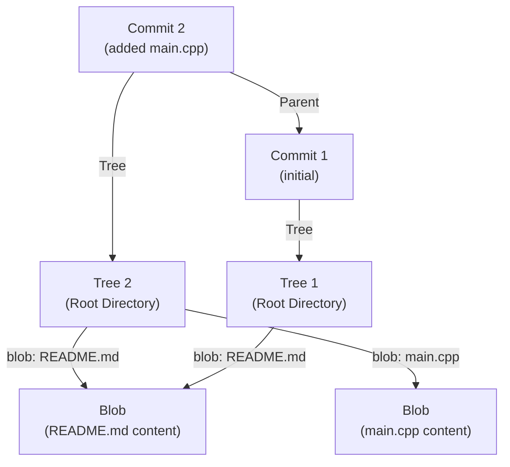

# VCC Deep Technical Details

VCC (Version Control Clone) relies heavily on content-addressable storage, cryptographic hashing, and a strictly structured hidden directory (`.vcc`) to immutably track a repository's graph of history. 

Git is essentially a content-addressable key–value storage system. Every piece of data (such as files and commits) is stored as an object and identified by a SHA-1 hash of its contents. Git uses this hash as the object’s name.

These objects are stored inside the `.git/objects` directory. To organize them efficiently, Git uses the first two characters of the hash as a folder name and the remaining characters as the file name. The file contains the compressed object data.

Depending on the object type, it may store:

* a **blob** (file contents),
* a **tree** (directory structure), or
* a **commit** (metadata and history).

This document provides a deep, low-level look into the exact data structures, algorithms, and hashing mechanisms powering VCC.

## The `.vcc` internal database

When `RepoManager::init()` executes, it generates the primary data store:
```text
.vcc/
├── objects/        # The immutable object database
│   ├── a1/         # Directory (first 2 characters of SHA-1)
│   │   └── b2c...  # File (remaining 38 characters of SHA-1)
├── refs/
│   └── heads/      # Mutable branch pointers (references)
│       └── main    # Contains a 40-char string pointing to the latest commit
└── index           # The mutable staging area flat file
```

---

## The Object Database (Content-Addressability)

VCC stores three definitive object types within `.vcc/objects/`. Unlike traditional databases that store records designated by incremental integer IDs, VCC is a **content-addressable filesystem**. Objects are stored and retrieved using the secure SHA-1 algorithm calculated locally against their own serialized structure.

### 1. Blobs (Binary Large Objects)
*   **Purpose:** To store the exact byte-for-byte contents of a staged file.
*   **VCC Format Details:** Unlike Git, which prepends a structural header header to the file (`blob <size>\0<content>`) before hashing, VCC's `IndexManager::add` currently performs a direct raw hash over the unadulterated file data:
    ```cpp
    std::string content = read_file(filename);
    SHA1 checksum; checksum.update(content);
    std::string hash = checksum.final();
    ```
*   **Missing Metadata:** Blobs explicitly drop filenames, permissions, and timestamps. If you rename `src/main.cpp` to `src/app.cpp` without changing the code, the resulting Blob hash is *perfectly identical* to the old one.

### 2. Trees
*   **Purpose:** To act as the directory hierarchy, mapping Blobs (and potentially sub-Trees) to human-readable filenames.
*   **VCC Format Details:** 
    When `TreeManager::write_tree()` executes, it accesses the staging area (`.vcc/index`), alphabetically sorts the entries (to guarantee deterministic hashing), and constructs a raw payload string formatted exactly like this:
    ```text
    100644 blob 8af7c... src/main.cpp
    100644 blob 2cf3b... README.md
    ```
    *(Note: `100644` corresponds to a standard non-executable text file mode).*
    This giant concatenated string is then cryptographically hashed and stored in the objects folder. The deterministic alphabetical sorting ensures that if two directories contain the exact same files, their Tree hashes will be perfectly identical.

### 3. Commits
*   **Purpose:** To take a snapshot of a Tree and bind it to a moment in time (Author, Message) and a lineage (Parent Commit).
*   **VCC Format Details:**
    `CommitManager::commit` builds a purely text-based payload string containing metadata headers followed by an empty line, and then the commit message:
    ```text
    tree 724505ffcdbe7324f617f3e166d3f44f17e0e34a
    parent 4fc37118897576c907dce5f629a0802113b578bf
    author Jyotishmoy Deka

    added codes
    ```
    Because the parent hash is historically enclosed inside the payload, altering *any* historical commit changes its hash, which recursively invalidates all subsequent children commits. This guarantees a mathematically verifiable, tamper-proof history.

---

## Object Graph Visualization

The resulting object graph acts as a Directed Acyclic Graph (DAG), seamlessly achieving extreme spatial efficiency through deduplication:



*(Because the exact layout and content of `README.md` didn't change between Commit 1 and Commit 2, Tree 2 naturally calculates the same SHA-1 address for the file, dynamically deduplicating the storage footprint.)*

---

## The Index (Staging Area) Internals

The Index forms the structural bridge between the working directory and the DAG database.
*   **Location:** `.vcc/index`
*   **Format:** It is a mutable, persistent flat text file containing entries separated by spaces:
    ```text
    8af7... src/main.cpp
    2cf3... README.md
    ```
*   **Mechanism:** When you execute `add`, `IndexManager` computes the blob, writes the blob binary payload to `.vcc/objects/`, and then overwrites or appends the associative entry into the `.vcc/index` dictionary. Ultimately, when a commit occurs, `TreeManager` consumes this flat file linearly to generate the root `Tree` object payload.

---

## The Checkout Algorithm Explained

The process of checking out a commit (i.e., traveling backward in time via `.\vcc.exe checkout <hash>`) is executed deterministically by the underlying `CheckoutManager::checkout()`:

1.  **Read Target:** Find the user-requested commit raw file inside `.vcc/objects/`.
2.  **Parse Payload:** Leverage a line-by-line parse loop to locate the prefix `"tree "` to cleanly slice out the 40-character tree hash.
3.  **Read Tree:** Locate the target Tree file in `.vcc/objects/` using that hash.
4.  **Parse Entries:** Iteratively parse the Tree file entries stream (`<mode> <type> <hash> <filename>`).
5.  **Reconstruct WD:** For every `blob` flag encountered, VCC locates its 40-character blob file, loads it entirely in binary mode, and physically overrides the target `<filename>` string path in your local working directory with the unadulterated binary payload.
6.  **Move HEAD:** The `HEAD` pointer at `.vcc/refs/heads/main` is silently rewritten to the target commit hash, firmly docking the system state into the executed snapshot.
