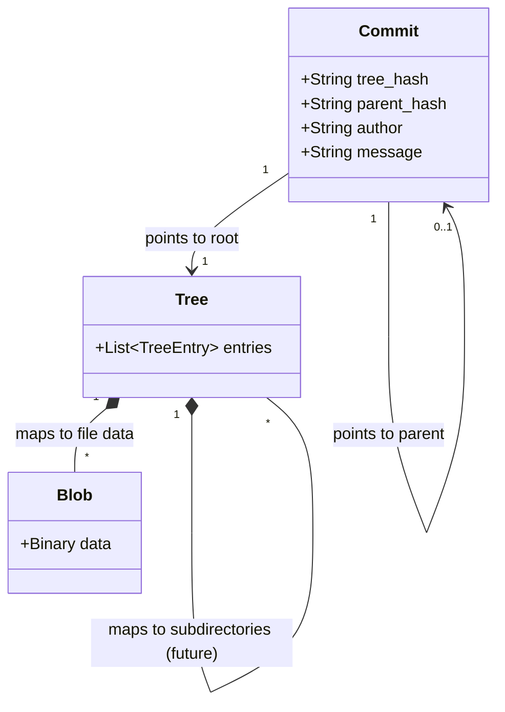

# VCC Technical Details

VCC (Version Control Clone) relies on content-addressable storage, cryptographic hashing, and a structured hidden directory (`.vcc`) to track the history of a repository. 

This document outlines the underlying technical mechanisms that power VCC.

## The `.vcc` Directory Structure

When a repository is initialized using `RepoManager::init()`, VCC creates a hidden `.vcc` folder at the root of the project. This folder acts as the database for the version control system.

```text
.vcc/
├── objects/        # Stores all content-addressable objects (Blobs, Trees, Commits)
├── refs/
│   └── heads/      # Stores branch pointers
│       └── main    # Contains the SHA-1 hash of the latest commit on the main branch
└── index           # The staging area (stores paths and their corresponding Blob hashes)
```

### The `index` File
The index serves as the staging area. When you add a file, VCC hashes its content, stores the blob in `objects/`, and records the mapping in `.vcc/index` in the format `<hash> <filepath>`.

## Cryptographic Hashing (SHA-1)

VCC uses **SHA-1 (Secure Hash Algorithm 1)** to identify and verify the integrity of files and system states.

- **Content-Addressable Storage:** Files are not saved by their original name in the database; they are saved by the SHA-1 hash of their content.
- **Deduplication:** If two files have the exact same content, they will produce an identical SHA-1 hash. VCC will only store the blob once, saving storage space.
- **Immutability:** Once an object is created and hashed, it cannot be modified. Any change in a file's content results in a completely new file and a new SHA-1 hash.

### Object Storage Optimization
To prevent the `.vcc/objects/` directory from containing too many files in a single flat structure (which can slow down file system reads), VCC uses the first 2 characters of the 40-character SHA-1 hash as a subdirectory name, and the remaining 38 characters as the filename. 

*Example:* 
Hash: `a1b2c3d4e5f6...` 
Path: `.vcc/objects/a1/b2c3d4e5f6...`

## Object Types

VCC utilizes three core data structures, all stored as hashed objects within the `.vcc/objects/` directory. The relationship between these objects is deterministic and forms the backbone of a repository's linear history:



### 1. Blobs (Binary Large Objects)
Created when a file is staged (added to the index via `.\vcc.exe add`). 
- **Structure:** A blob simply contains the raw, uncompressed binary data of a file. 
- **Metadata Separation:** Blobs purposefully *do not* store file metadata such as the filename, timestamp, or permissions. 
- **Complete Deduplication:** Because a blob is strictly based on the content, if you have multiple copies of the exact same file in different directories or branches, VCC only stores the binary data once as a single Blob object. The paths are tracked separately by the Tree objects.

### 2. Trees
Created during a commit via `.\vcc.exe write-tree`. A tree represents a directory's state at a snapshot. It contains a list of pointers to Blobs (files) and potentially other Trees (subdirectories). 
A tree entry typically looks like:
`100644 blob <blob_hash> <filename>`
By storing the `<filename>` here rather than in the Blob, VCC easily reconstructs the file hierarchy.

### 3. Commits
Created via `.\vcc.exe commit`. A commit represents a complete snapshot of the project at a given point in time. It ties the repository state together by storing:
- A pointer to the root **Tree** hash.
- A pointer to the **Parent Commit** hash (to maintain a linear history).
- **Author** information.
- The **Commit Message**.

When you check out a commit, VCC reads the Commit object, finds the associated Tree, retrieves the corresponding Blobs using the hashes found in the tree entries, and overwrites the Working Directory to match that saved state exactly.
